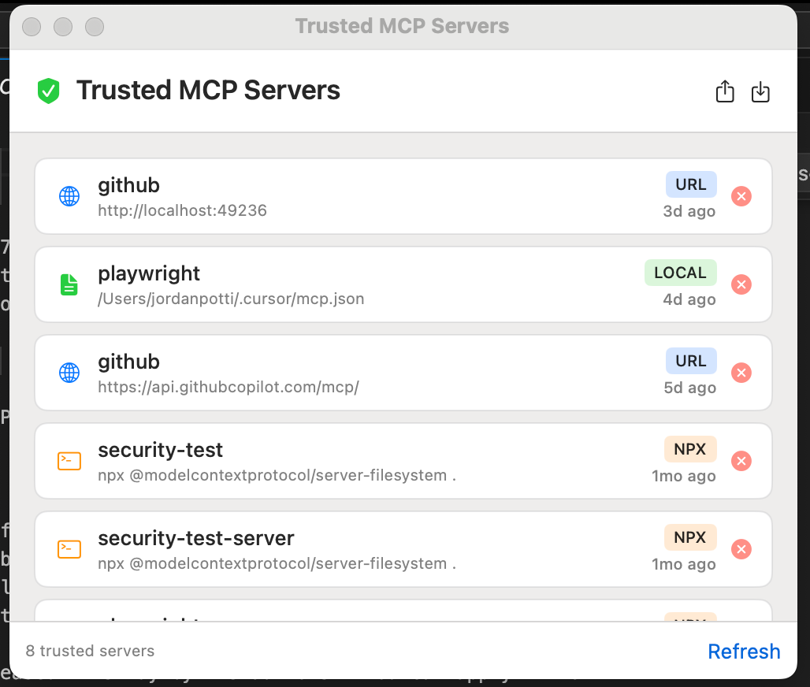
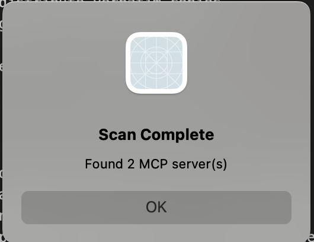
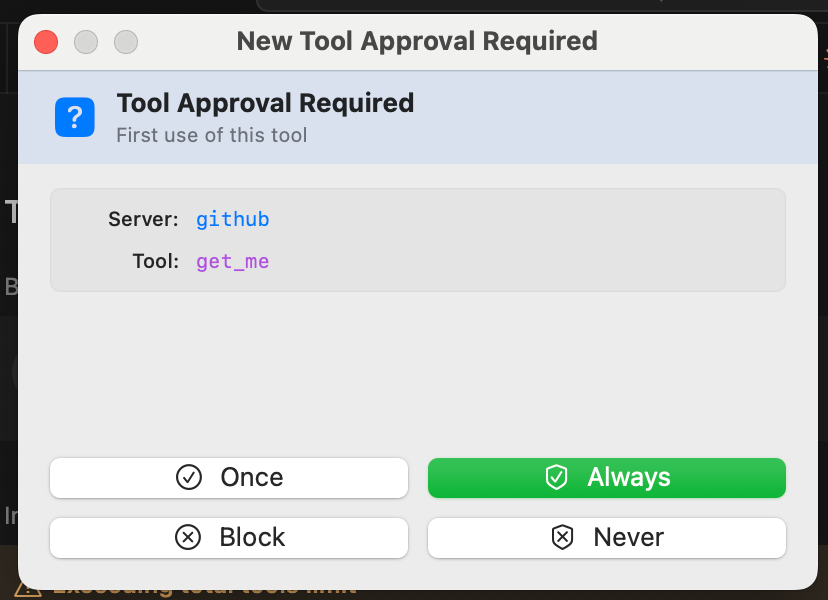
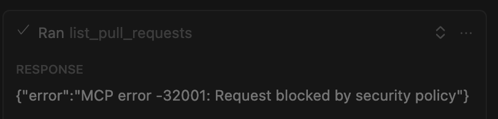
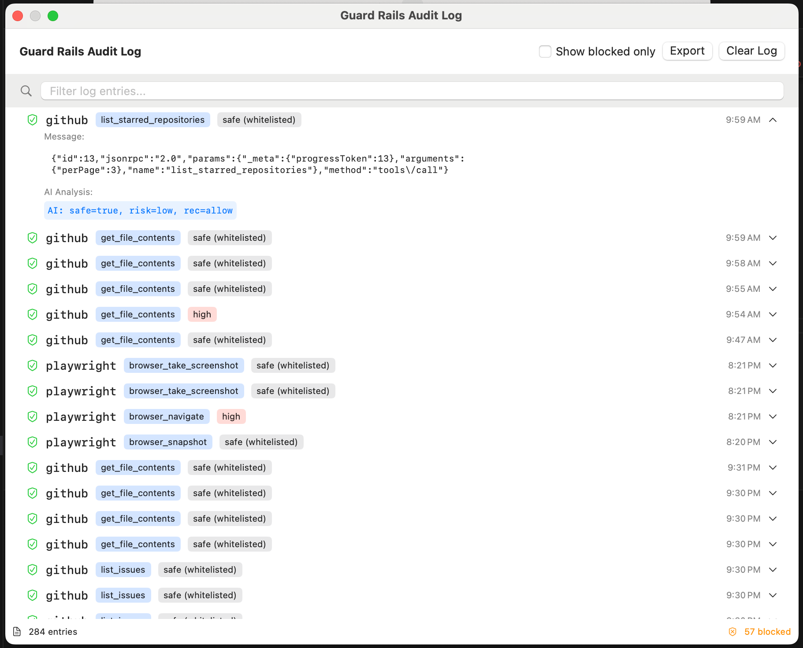
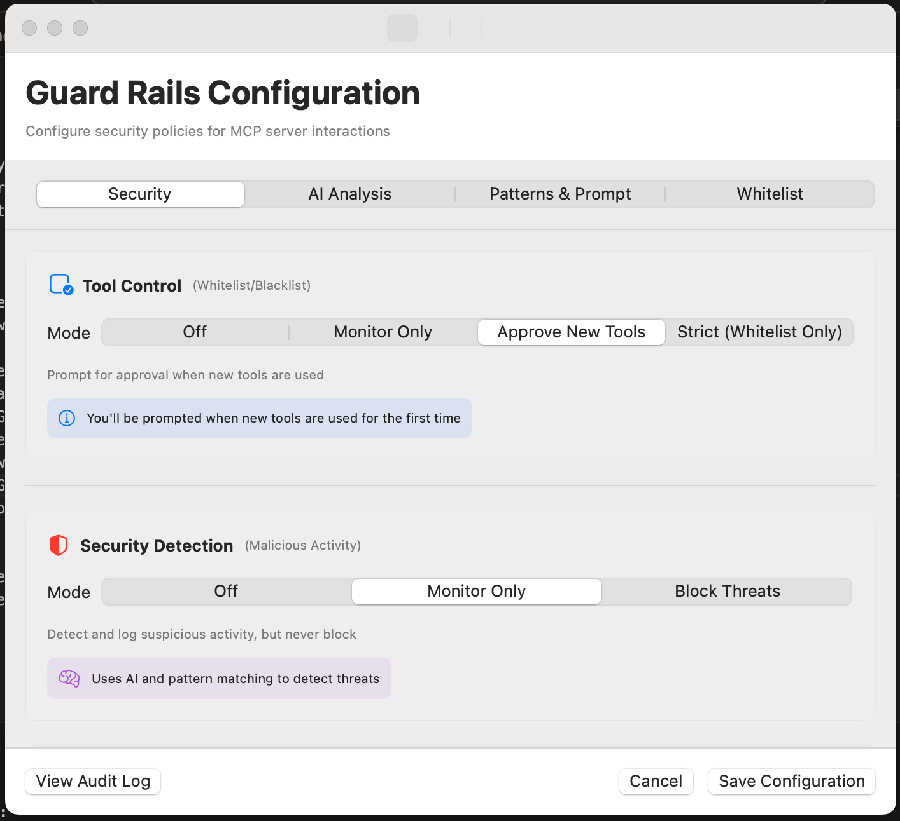
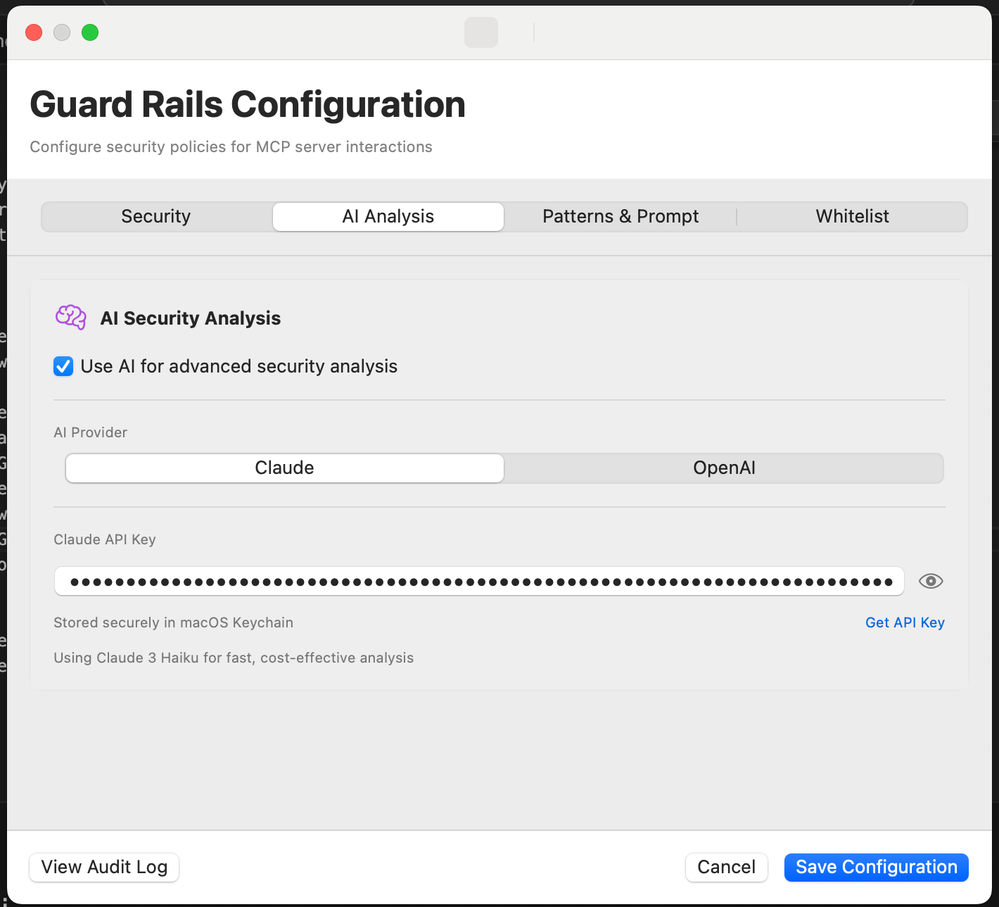
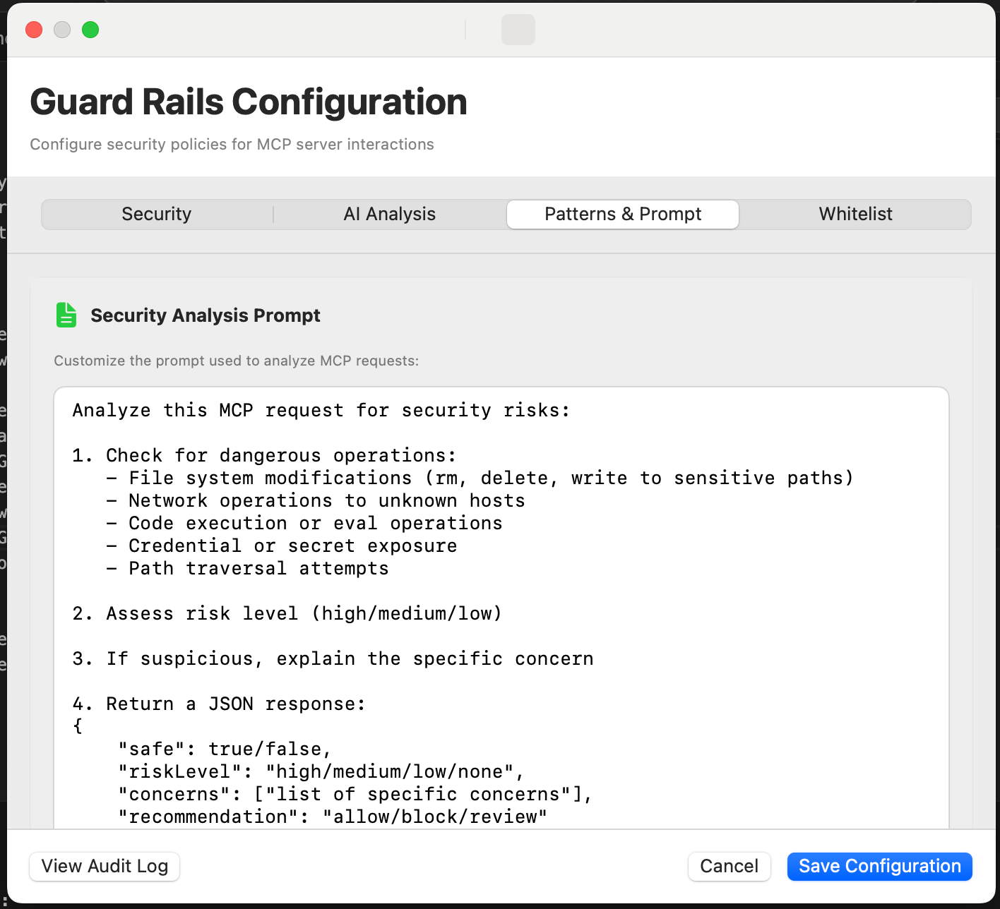
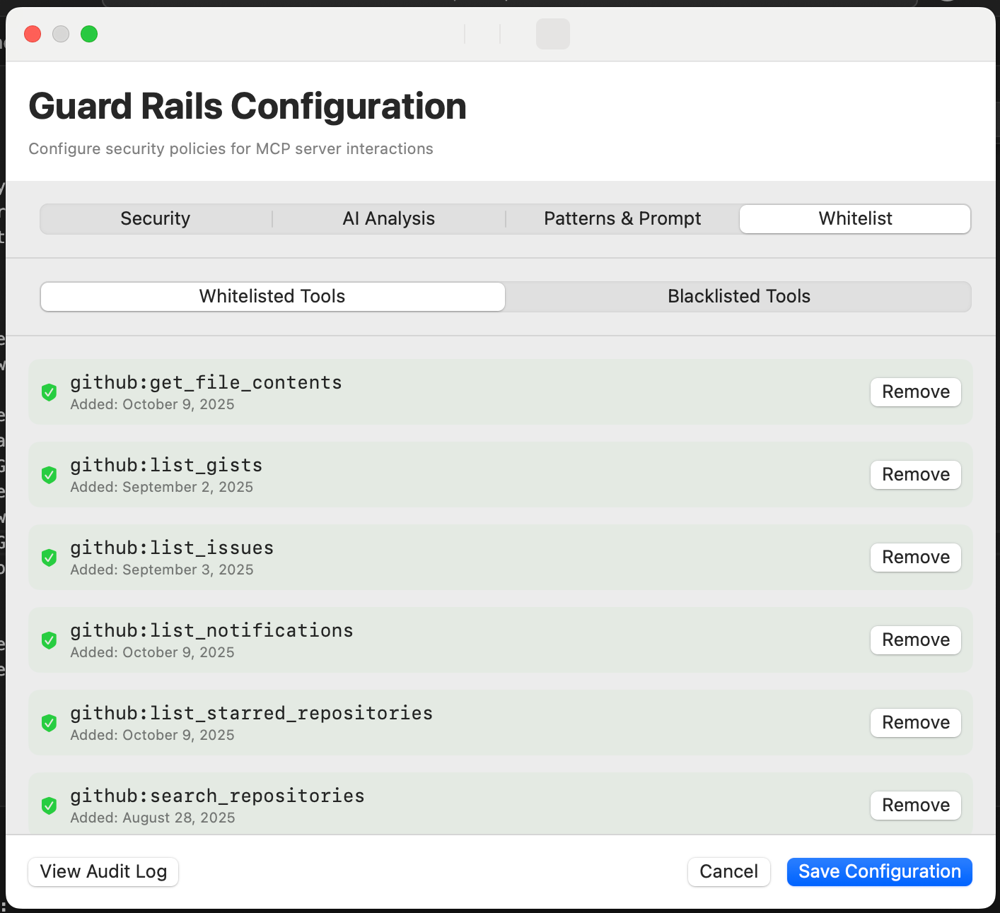
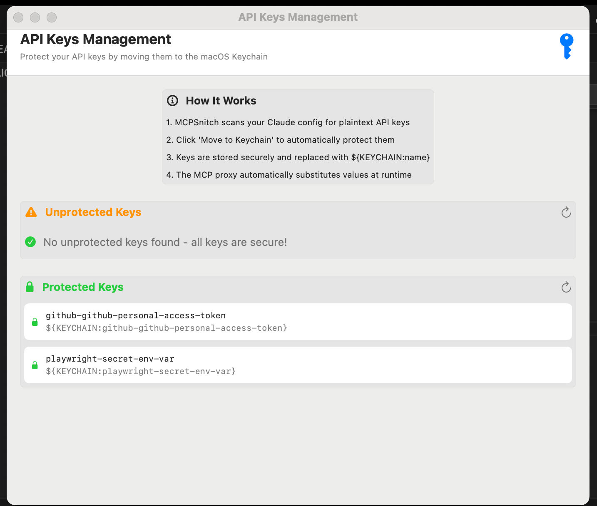

# MCP Snitch

**Security monitoring and access control for Model Context Protocol (MCP) servers**

MCP Snitch is a macOS application that intercepts and monitors MCP server communications, providing security analysis, access control, and audit logging for AI tool usage.

## Screenshots

### Server Management

*View and manage trusted MCP servers with automatic discovery of Claude Desktop and Cursor configurations*

### Automatic Server Discovery

*Automatically scan and discover MCP servers from your AI tool configurations*

### Tool Approval System

*Approve or block new tool calls with granular control - once, always, or never*

### Security Blocked Request

*MCP Snitch blocks suspicious requests and provides clear feedback*

## Features

### 🔒 Security Monitoring
- **Real-time interception** of stdio and HTTP MCP transports
- **AI-powered security analysis** using GPT-3.5 for threat detection
- **Pattern-based detection** for sensitive data (SSH keys, credentials, system files)
- **Audit logging** with full request/response history


*Comprehensive audit log showing all MCP tool calls with risk assessment and filtering*

### 🛡️ GuardRails
- **Approve/Block mode** - Manual approval for tool calls
- **Auto-approve trusted tools** - Whitelist safe operations
- **Trust management** - Per-server trust settings with database storage
- **Risk assessment** - AI analysis of tool call intentions


*Configure security policies including tool control modes and threat detection*


*Enable AI-powered security analysis with Claude or OpenAI*


*Customize the AI security analysis prompt for your specific needs*


*Manage whitelisted and blacklisted tools for automated control*

### 🌐 Universal MCP Support
- **Stdio servers** - npx, Docker, local binaries
- **HTTP servers** - Remote MCP endpoints (GitHub MCP, etc.)
- **Session management** - Automatic session ID handling
- **Keychain integration** - Secure API key storage


*Protect API keys by moving them to macOS Keychain for secure storage*

### 📊 Monitoring
- **Live message viewer** - See all MCP communications in real-time
- **Server discovery** - Automatic detection of Claude Desktop & Cursor configs
- **Protection status** - Visual indicators for monitored servers
- **Export logs** - Full audit trail for compliance

## Quick Start

### For Users

1. **Download** the latest DMG from [Releases](../../releases)
2. **Install** MCP Snitch by dragging to Applications
3. **Launch** and grant necessary permissions
4. **Protect** your MCP servers from the main interface

### For Developers

```bash
# Clone the repository
git clone https://github.com/Adversis/mcp-snitch.git
cd mcp-snitch

# Build development version
./build.sh

# Run the app
./run.sh
```

See [CONTRIBUTING.md](CONTRIBUTING.md) for detailed setup instructions.

## How It Works

MCP Snitch acts as a transparent proxy between AI applications (Claude Desktop, Cursor) and MCP servers:

```
Cursor → MCP Snitch Proxy → MCP Server
                      ↓
                Security Analysis
                Audit Logging
                GuardRails Enforcement
```

### Stdio Proxy
- Wraps command-based servers (npx, docker, local binaries)
- Intercepts stdin/stdout for JSON-RPC analysis
- Transparent to both client and server

### HTTP Proxy
- Local HTTP proxy for remote MCP servers
- Manages session IDs automatically
- Injects authentication headers from keychain

## Security Analysis

MCP Snitch uses multiple layers of security analysis:

1. **Pattern Detection** - Fast regex-based checks for known threats
2. **Trust Verification** - Database lookup for trusted servers
3. **AI Analysis** - GPT-3.5 analysis for complex tool calls
4. **Response Monitoring** - Scans outputs for sensitive data leaks

### Example Threats Detected
- File system access to sensitive directories (`/etc`, `/System`)
- SSH key or credential exposure
- Unusual API calls or data exfiltration patterns
- System command execution

## Configuration

### Trusted Servers
Trust servers to skip approval prompts:
- Settings → Servers → Trust/Untrust

### GuardRails Modes
- **Off** - No interception
- **Approve** - Manual approval for all tool calls
- **Block** - Automatic blocking with AI analysis

### API Keys
Store OpenAI API key securely in macOS Keychain:
- Settings → API Keys → Add Key

## Architecture

```
MCPSnitch/          # Main macOS app (SwiftUI)
  ├── Views/        # UI components
  ├── Models/       # Data models & database
  └── Managers/     # Business logic

MCPProxy/           # Proxy implementations
  ├── mcp_proxy.swift            # Stdio proxy
  ├── mcp_http_proxy.swift       # HTTP proxy
  └── mcp_security_common.swift  # Shared security logic
```

## Requirements

- macOS 13.0 or later
- Xcode 15.0+ (for building from source)
- OpenAI API key (for AI security analysis)

## Licensing

This project is available under a dual-license model:

- **Open Source License**: GNU General Public License v3.0 (GPL-3.0) - See [LICENSE](LICENSE) file
- **Commercial License**: For proprietary use without GPL obligations - Contact licensing@adversis.io

### Why Dual Licensing?

- **Open Source**: Free use under GPL-3.0 for open source projects and personal use
- **Commercial**: Avoid GPL obligations for proprietary/commercial software

For commercial licensing inquiries, please contact licensing@adversis.io

## ⚠️ DISCLAIMER

THIS SOFTWARE IS PROVIDED "AS IS", WITHOUT WARRANTY OF ANY KIND, EXPRESS OR IMPLIED, INCLUDING BUT NOT LIMITED TO THE WARRANTIES OF MERCHANTABILITY, FITNESS FOR A PARTICULAR PURPOSE AND NONINFRINGEMENT. IN NO EVENT SHALL THE AUTHORS OR COPYRIGHT HOLDERS BE LIABLE FOR ANY CLAIM, DAMAGES OR OTHER LIABILITY, WHETHER IN AN ACTION OF CONTRACT, TORT OR OTHERWISE, ARISING FROM, OUT OF OR IN CONNECTION WITH THE SOFTWARE OR THE USE OR OTHER DEALINGS IN THE SOFTWARE.

**SECURITY NOTICE**: This tool is designed for authorized security monitoring only. Users are responsible for complying with all applicable laws and regulations. Unauthorized use of this tool may result in criminal and/or civil penalties. Always ensure you have proper authorization before monitoring any systems or applications.

## Contributing

We welcome contributions! See [CONTRIBUTING.md](CONTRIBUTING.md) for guidelines.

## Support

- **Issues** - Report bugs or request features via [GitHub Issues](../../issues)
- **Discussions** - Ask questions in [GitHub Discussions](../../discussions)

## Acknowledgments

Built with:
- Swift & SwiftUI
- SQLite for trust database
- OpenAI GPT-3.5 for security analysis
- Model Context Protocol specification

---

Copyright © 2025 Adversis, LLC. Licensed under GPL-3.0 or Commercial License.
